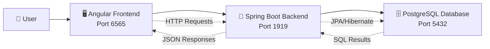
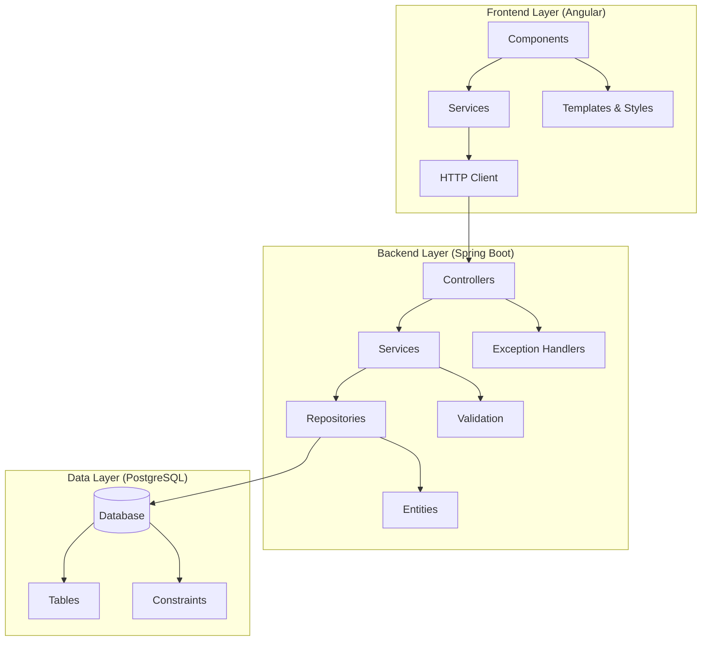
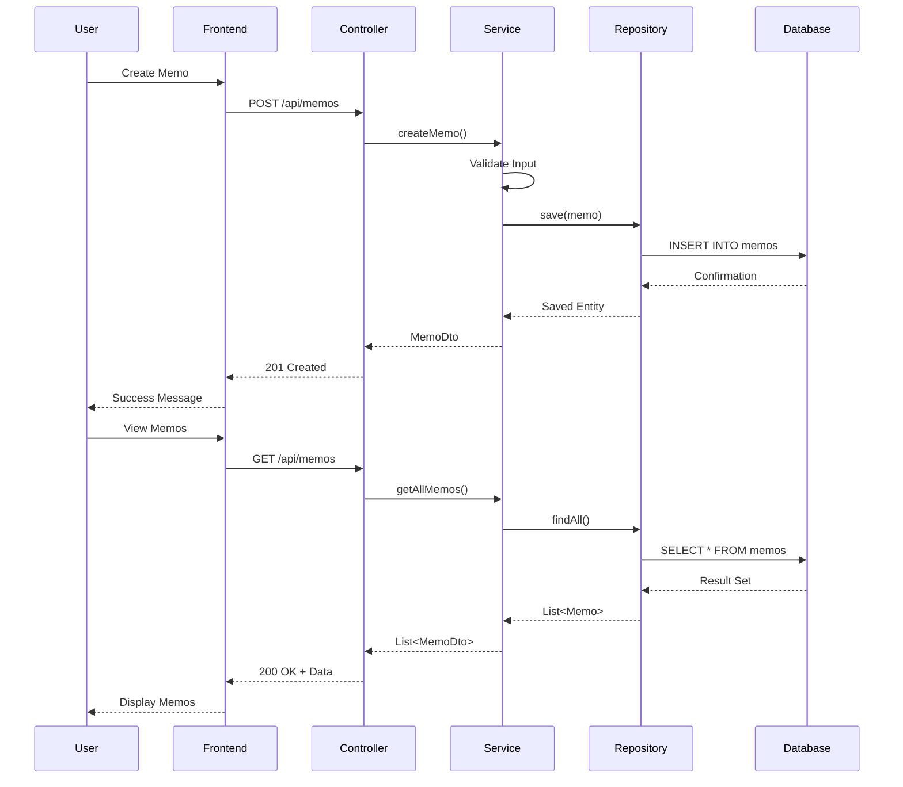
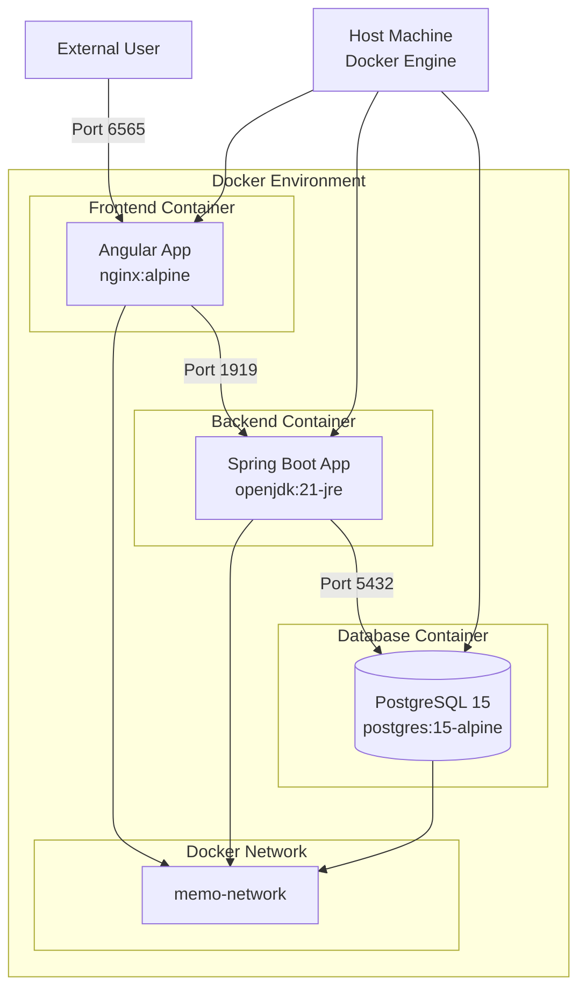
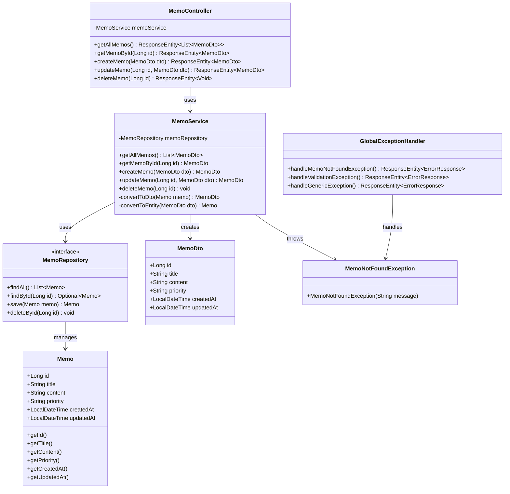

# MemoApp - Complete Documentation

## Overview

MemoApp is a full-stack note-taking application built with modern technologies. It consists of a Spring Boot backend REST API and an Angular frontend, designed to provide a comprehensive memo management system.

## System Architecture

The application follows a three-tier architecture pattern with clear separation of concerns:

### High-Level Architecture



### Component Architecture



### Technology Stack

**Backend:**
- Java 21
- Spring Boot 3.2.2
- Spring Data JPA
- PostgreSQL 15
- Gradle 8.8
- Docker & Docker Compose

**Frontend:**
- Angular 20.1.0
- TypeScript 5.8.2
- RxJS 7.8.0

**Development & Testing:**
- JUnit Jupiter
- Testcontainers
- Karma & Jasmine

## Key Features

- **CRUD Operations**: Create, read, update, and delete memos
- **RESTful API**: Clean REST API design following industry standards
- **Data Validation**: Comprehensive input validation on both frontend and backend
- **Error Handling**: Robust exception handling with meaningful error messages
- **Database Management**: Automated schema management with Hibernate
- **Containerization**: Full Docker support for easy deployment
- **Testing**: Comprehensive test coverage with unit and integration tests

### Data Flow Diagram



### Deployment Architecture



## Project Structure

```
MemoApp/
├── docs/                           # Documentation
├── MemoApp_Backend/                # Spring Boot backend
│   ├── app/
│   │   ├── src/main/java/memoapp/
│   │   │   ├── App.java            # Main application class
│   │   │   ├── controller/         # REST controllers
│   │   │   ├── service/            # Business logic
│   │   │   ├── repository/         # Data access layer
│   │   │   ├── entity/             # JPA entities
│   │   │   ├── exception/          # Custom exceptions
│   │   │   └── config/             # Configuration classes
│   │   └── src/test/               # Test classes
│   ├── Dockerfile                  # Backend container config
│   └── docker-compose.yml          # Multi-container setup
└── MemoApp_Frontend/               # Angular frontend
    ├── src/app/
    │   ├── components/             # Angular components
    │   ├── services/               # HTTP services
    │   ├── models/                 # TypeScript interfaces
    │   └── environments/           # Environment configurations
    └── package.json                # Frontend dependencies
```

## Documentation Index

1. [System Architecture](./system-architecture.md) - Detailed architectural overview
2. [API Documentation](./api-documentation.md) - Complete REST API reference
3. [Setup Guide](./setup-guide.md) - Installation and configuration instructions
4. [Database Schema](./database-schema.md) - Database design and configuration
5. [Development Guide](./development-guide.md) - Development workflows and best practices
6. [Frontend Guide](./frontend-guide.md) - Angular frontend architecture and components

## Quick Start

### Using Docker (Recommended)

1. Clone the repository
2. Navigate to the backend directory:
   ```bash
   cd MemoApp_Backend
   ```
3. Start all services:
   ```bash
   docker-compose up --build
   ```

### Manual Setup

1. Start PostgreSQL database
2. Run backend:
   ```bash
   cd MemoApp_Backend
   ./gradlew bootRun
   ```
3. Run frontend:
   ```bash
   cd MemoApp_Frontend
   npm install
   npm start
   ```

## Accessing the Application

- **Frontend**: http://localhost:6565
- **Backend API**: http://localhost:1919/api
- **Database**: localhost:5432 (memoapp/memoapp/password)

## Design Principles

The application follows SOLID principles and clean architecture patterns:

- **Single Responsibility**: Each class has one clear purpose
- **Open/Closed**: Components are open for extension, closed for modification
- **Dependency Inversion**: High-level modules don't depend on low-level modules
- **Separation of Concerns**: Clear separation between presentation, business, and data layers
- **Exception Handling**: Comprehensive error handling with custom exceptions

### Backend Class Diagram



### Development Workflow

```mermaid
gitgraph
    commit id: "Initial setup"
    commit id: "Backend structure"
    branch feature-memo-crud
    commit id: "Add Memo entity"
    commit id: "Add CRUD operations"
    commit id: "Add validation"
    checkout main
    merge feature-memo-crud
    commit id: "Release v1.0"
    branch feature-priority
    commit id: "Add priority field"
    commit id: "Update frontend UI"
    checkout main
    merge feature-priority
    commit id: "Release v1.1"
```

## License

This project is for educational purposes.